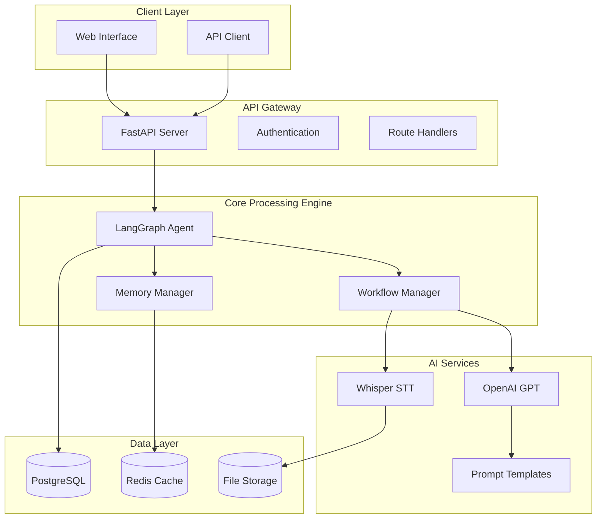
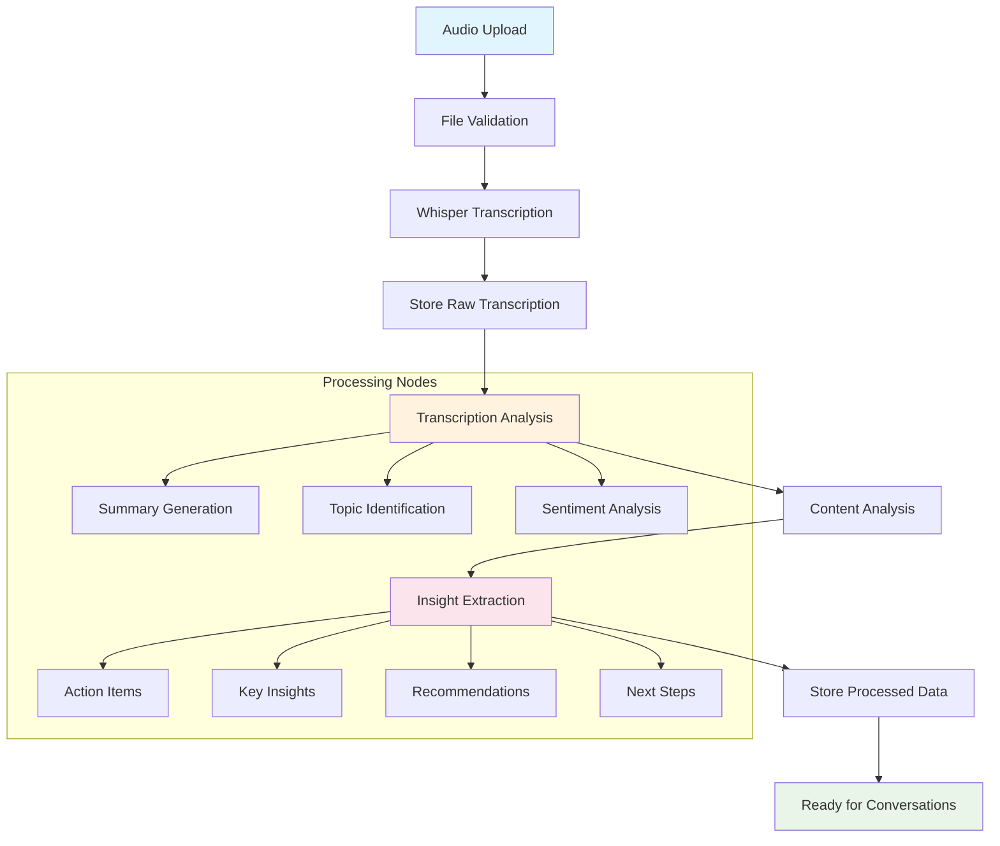
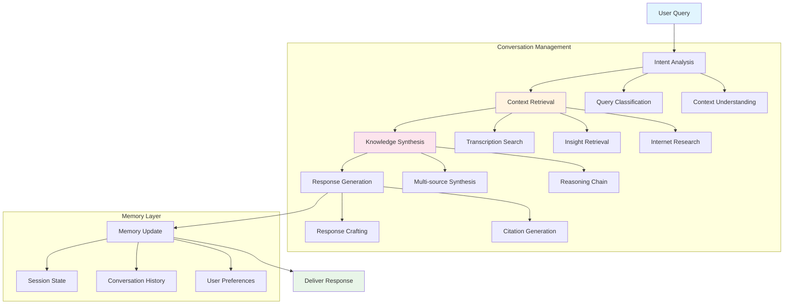
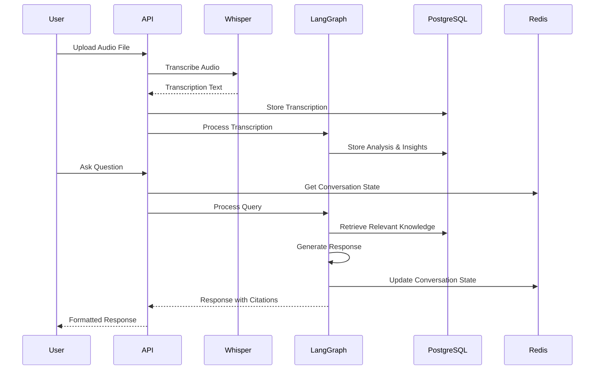

# The Oracle 🔮
## AI-Powered Knowledge Management & Conversation Platform

[](https://opensource.org/licenses/MIT)
[](https://www.python.org/downloads/)
[](https://fastapi.tiangolo.com)
[](https://www.postgresql.org)
[](https://redis.io)

---

**The Oracle** is a revolutionary knowledge management platform that transforms how individuals and organizations capture, organize, and interact with their knowledge. By uploading audio recordings—whether from meetings, client calls, or voice notes—users can generate rich insights and engage in intelligent conversations with their own accumulated knowledge, enhanced by internet connectivity.

## 📖 Table of Contents

- [🎯 Product Overview](#-product-overview)
- [🏗️ Architecture & Workflows](#️-architecture--workflows)
- [💼 Business Value](#-business-value)
- [📊 Metrics Framework](#-metrics-framework)
- [🔄 MVP Roadmap](#-mvp-roadmap)
- [🏛️ Infrastructure Decisions](#️-infrastructure-decisions)
- [🛠️ Development Setup](#️-development-setup)
- [📋 API Reference](#-api-reference)
- [🔧 Configuration](#-configuration)
- [🚀 Deployment](#-deployment)

---

## 🎯 Product Overview

### Vision
Replace traditional note-taking with AI-powered knowledge management that captures, processes, and makes your information instantly accessible and actionable.

### Core Value Proposition
- **🎤 Voice-First Knowledge Capture**: Transform audio into structured, searchable knowledge
- **🧠 AI-Powered Insights**: Automatically extract action items, themes, and strategic insights
- **💬 Conversational Knowledge Access**: Chat with your accumulated knowledge as if talking to your own mind
- **🌐 Internet-Enhanced**: Connected conversations that can access real-time information
- **📊 Centralized Organization**: One platform for all your knowledge, eliminating scattered notes

### Target Users
- **Executives & Managers**: Meeting recordings, strategic discussions, client calls
- **Consultants & Freelancers**: Client interviews, project notes, research findings
- **Researchers & Analysts**: Interview transcriptions, research notes, data insights
- **Teams & Organizations**: Knowledge sharing, meeting documentation, decision tracking

---

## 🏗️ Architecture & Workflows

### System Architecture



### Workflow 1: Audio Processing Pipeline



### Workflow 2: Conversational Knowledge Interface



### Data Flow Architecture



---

## 💼 Business Value

### 🏢 Enterprise Benefits

#### Knowledge Management Revolution
- **Reduce Information Silos**: Centralize organizational knowledge from meetings, calls, and discussions
- **Accelerate Decision Making**: Instant access to historical decisions, rationale, and outcomes
- **Improve Onboarding**: New employees can access institutional knowledge through conversations
- **Enhance Compliance**: Automated documentation and retrieval of important discussions

#### Operational Efficiency Gains
- **Save 60-80% Documentation Time**: Automated transcription and insight extraction
- **Increase Meeting ROI**: Transform every meeting into structured, searchable knowledge
- **Reduce Knowledge Loss**: Prevent expertise from being lost when employees leave
- **Scale Expertise**: Make subject matter experts' knowledge accessible organization-wide

#### Strategic Advantages
- **Pattern Recognition**: Identify trends and insights across multiple conversations
- **Client Intelligence**: Build comprehensive understanding of client needs and feedback
- **Risk Mitigation**: Early identification of concerns and potential issues
- **Innovation Catalyst**: Connect ideas across different conversations and contexts

### 🎯 Use Case Scenarios

#### Executive Leadership
- **Board Meeting Documentation**: Automatic minutes generation with action items
- **Strategic Planning**: Access to historical strategic discussions and outcomes
- **Client Relationship Management**: Comprehensive view of all client interactions
- **Performance Reviews**: Data-driven insights from team discussions

#### Sales & Customer Success
- **Client Call Analysis**: Automated extraction of requirements, concerns, and opportunities
- **Proposal Development**: Access to similar past proposals and client feedback
- **Account Management**: Complete history of client interactions and preferences
- **Training & Development**: Learn from top performers' conversation patterns

#### Research & Development
- **Research Interview Analysis**: Structured insights from user research sessions
- **Ideation Documentation**: Capture and organize brainstorming sessions
- **Technical Documentation**: Convert technical discussions into searchable knowledge
- **Competitive Intelligence**: Organize and analyze market research conversations

---

## 📊 Metrics Framework

### 🏢 Business Level Metrics (Area Managers)

#### Productivity & Efficiency
- **Documentation Time Reduction**: Measure decrease in manual note-taking and documentation time
  - *Measurement*: Time tracking before/after implementation

- **Knowledge Retrieval Speed**: Time to find relevant information
  - *Measurement*: Query response time analytics

- **Decision Making Velocity**: Speed of information-based decisions
  - *Measurement*: Decision timeline tracking

#### Knowledge Management ROI
- **Knowledge Utilization Rate**: How often stored knowledge is accessed
  - *Measurement*: Content access analytics

- **Cross-Functional Knowledge Sharing**: Information flow between departments
  - *Measurement*: Knowledge graph analysis

- **Compliance & Risk Reduction**: Automated documentation compliance
  - *Measurement*: Audit trail completeness

### 👤 Product Level Metrics (User Experience)

#### User Engagement & Adoption
- **Daily Active Users (DAU)**: Regular platform engagement
  - *Measurement*: User session analytics

- **Feature Adoption Rate**: Usage of core features
  - *Measurement*: Feature usage tracking

- **Session Duration**: Time spent per session
  - *Measurement*: Session analytics

#### User Satisfaction & Retention
- **Net Promoter Score (NPS)**: User satisfaction and advocacy
  - *Measurement*: Quarterly user surveys

- **Task Completion Rate**: Successful completion of user workflows
  - *Measurement*: Workflow analytics

- **User Retention Rate**: Long-term platform usage
  - *Measurement*: Cohort analysis

#### Content Quality & Accuracy
- **Transcription Accuracy**: Quality of speech-to-text conversion
  - *Measurement*: Manual accuracy sampling

- **Insight Relevance**: Quality of AI-generated insights
  - *Measurement*: User feedback ratings

- **Response Accuracy**: Correctness of conversational responses
  - *Measurement*: User feedback and fact-checking

### 💰 Resources Level Metrics (Technical & Cost)

#### Infrastructure Performance
- **API Response Time**: System responsiveness
  - *Measurement*: APM monitoring (e.g., New Relic, DataDog)

- **System Uptime**: Platform availability
  - *Measurement*: Infrastructure monitoring

- **Scalability**: System performance under load
  - *Measurement*: Load testing metrics

#### Cost Optimization
- **Processing Cost per Hour**: Audio transcription and analysis costs
  - *Measurement*: Cloud service billing analysis

- **Token Usage Efficiency**: AI model consumption optimization
  - *Measurement*: LLM API usage tracking

- **Storage Cost per User**: Data storage optimization
  - *Measurement*: Database and file storage metrics

#### Technical Quality
- **Error Rate**: System reliability
  - *Measurement*: Error logging and monitoring

- **Code Quality**: Development velocity and maintainability
  - *Measurement*: SonarQube, test coverage tools

- **Security Posture**: Data protection and compliance
  - *Measurement*: Security audits, penetration testing

---

## 🔄 MVP Roadmap

### Phase 1: Core MVP (Months 1-3)
- ✅ **Audio Upload & Transcription**: Basic Whisper integration
- ✅ **Insight Extraction**: Automated analysis and summary generation
- ✅ **Basic Chat Interface**: Question-answering about transcriptions
- ✅ **Data Persistence**: PostgreSQL storage for transcriptions and insights
- ✅ **Memory Management**: Redis-based conversation state

### Phase 2: Enhanced Intelligence (Months 4-6)
- 🔄 **Advanced Analytics**: Sentiment analysis, topic clustering, trend identification
- 🔄 **Multi-Speaker Recognition**: Speaker diarization and individual insights
- 🔄 **Smart Summarization**: Automated meeting minutes and action items
- 🔄 **Knowledge Graph**: Relationship mapping between concepts and conversations
- 🔄 **Search Enhancement**: Semantic search across all stored knowledge

### Phase 3: Enterprise Features (Months 7-9)
- 📋 **Team Collaboration**: Shared knowledge spaces and permission management
- 📋 **Integration Suite**: Calendar sync, CRM integration, productivity tools
- 📋 **Advanced Security**: End-to-end encryption, audit logs, compliance features
- 📋 **Custom Workflows**: Configurable processing pipelines for different use cases
- 📋 **Analytics Dashboard**: Business intelligence and usage analytics

### Phase 4: Advanced AI (Months 10-12)
- 📋 **Predictive Insights**: Anticipate information needs and surface relevant content
- 📋 **Automated Actions**: Trigger workflows based on conversation content
- 📋 **Multi-Modal Processing**: Video analysis, document integration, image processing
- 📋 **Personalized AI**: Adaptive AI that learns individual communication patterns
- 📋 **Enterprise AI**: Custom model fine-tuning for industry-specific terminology

### Post-MVP Evolution Opportunities

#### Vertical Specialization
- **Healthcare**: HIPAA compliance, medical terminology, patient interaction analysis
- **Legal**: Legal document analysis, case law reference, compliance monitoring
- **Education**: Lecture transcription, student interaction analysis, curriculum development
- **Finance**: Regulatory compliance, risk assessment, client advisory documentation

#### Platform Expansion
- **Mobile Applications**: Native iOS/Android apps with offline capabilities
- **API Marketplace**: Third-party integrations and custom applications
- **White-Label Solutions**: Branded implementations for enterprise clients
- **AI Model Marketplace**: Specialized models for different industries and use cases

#### Advanced Features
- **Real-Time Processing**: Live transcription and analysis during meetings
- **Multilingual Support**: Global deployment with language-specific optimizations
- **Augmented Reality**: Spatial computing interfaces for immersive knowledge interaction
- **Blockchain Integration**: Immutable knowledge records and decentralized storage

---

## 🏛️ Infrastructure Decisions

### Core Technology Stack

#### Backend Framework: FastAPI
**Decision**: FastAPI with Python 3.11+
**Rationale**:
- **Performance**: Async/await support for high-concurrency AI workloads
- **Developer Experience**: Automatic API documentation, type hints, validation
- **Ecosystem**: Rich Python AI/ML ecosystem integration
- **Scalability**: Easy horizontal scaling and microservices architecture

**Trade-offs**:
- ✅ Rapid development and prototyping
- ✅ Excellent AI/ML library compatibility
- ❌ Not as performant as Go/Rust for pure compute tasks
- ❌ GIL limitations for CPU-intensive tasks (mitigated by async design)

#### Database: PostgreSQL
**Decision**: PostgreSQL 15+ with JSONB support
**Rationale**:
- **Flexibility**: Structured data for core entities, JSONB for dynamic metadata
- **Performance**: Excellent query performance with proper indexing
- **ACID Compliance**: Reliable data consistency for business-critical information
- **Vector Extensions**: Future-ready for embedding-based search (pgvector)

**Trade-offs**:
- ✅ Mature, battle-tested in enterprise environments
- ✅ Rich ecosystem and tooling
- ❌ More complex setup than NoSQL alternatives
- ❌ Requires careful schema design for optimal performance

#### Memory/Caching: Redis
**Decision**: Redis 7+ for LangGraph checkpointing and caching
**Rationale**:
- **LangGraph Integration**: Native support for conversation state persistence
- **Performance**: Sub-millisecond access times for conversation context
- **Persistence Options**: Configurable durability vs. performance
- **Pub/Sub**: Real-time features and event-driven architectures

**Trade-offs**:
- ✅ Extremely fast memory access
- ✅ Rich data structures and operations
- ❌ Memory-bound scaling (requires careful memory management)
- ❌ Additional infrastructure complexity

#### AI/ML Stack: OpenAI + Whisper
**Decision**: OpenAI GPT models + Open-source Whisper
**Rationale**:
- **Quality**: State-of-the-art performance for both transcription and generation
- **Cost-Effectiveness**: Whisper is free, GPT pricing is competitive
- **Reliability**: Proven enterprise-grade stability
- **Rapid Development**: Focus on application logic vs. model training

**Trade-offs**:
- ✅ Best-in-class quality and reliability
- ✅ Rapid time-to-market
- ❌ Vendor dependency for core functionality
- ❌ Data privacy considerations (mitigated by careful prompt design)

### LangGraph Orchestration

#### Multi-Agent Architecture
**Decision**: LangGraph for complex workflow orchestration
**Rationale**:
- **Workflow Complexity**: Handle multi-step processing and conversation management
- **State Management**: Built-in checkpointing and recovery mechanisms
- **Async Operations**: Parallel processing and background task management
- **Debugging**: Rich introspection and monitoring capabilities

**Implementation**:
```python
# Processing Workflow: Audio → Insights
ProcessingWorkflow:
  - TranscriptionLoader → TranscriptionAnalyzer
  - TranscriptionAnalyzer → InsightExtractor  
  - InsightExtractor → ResultsStorage

# Conversation Workflow: Query → Response
DefaultWorkflow:
  - IntentSeeker → Manager → TaskOrchestrator
  - TaskOrchestrator (subgraph) → TouchPoint
```

#### Memory Architecture
**Decision**: Dual checkpointer strategy (Redis primary, PostgreSQL backup)
**Rationale**:
- **Performance**: Redis for fast conversation state access
- **Durability**: PostgreSQL for long-term conversation persistence
- **Flexibility**: Switch between checkpointers based on use case

### Deployment Strategy

#### Containerization: Docker + Docker Compose
**Decision**: Docker-based deployment with multi-stage builds
**Rationale**:
- **Development Parity**: Identical environments across dev/staging/production
- **Dependency Management**: Isolated, reproducible runtime environments
- **Scalability**: Container orchestration ready (Kubernetes)
- **CI/CD Integration**: Streamlined build and deployment pipelines

**Architecture**:
```yaml
Services:
  - API: FastAPI application with Gunicorn
  - PostgreSQL: Database with health checks
  - Redis: Memory store with persistence
  - Nginx: Reverse proxy and static file serving (production)
```

#### Development Environment
**Decision**: Make-based development workflow
**Rationale**:
- **Simplicity**: One-command setup and common operations
- **Documentation**: Self-documenting commands with help system
- **Flexibility**: Support for partial service startup during development

### Security & Privacy Considerations

#### Data Protection
- **Encryption**: TLS 1.3 for data in transit
- **Storage**: Encrypted database volumes in production
- **API Security**: Rate limiting, request validation, CORS policies
- **Access Control**: Role-based permissions (planned for enterprise)

#### Privacy Design
- **Data Minimization**: Store only necessary metadata
- **User Control**: Full data export and deletion capabilities
- **Audit Logging**: Complete activity trails for compliance
- **Consent Management**: Granular privacy preferences

### Monitoring & Observability

#### Application Performance
- **Metrics**: Prometheus + Grafana for system metrics
- **Logging**: Structured logging with correlation IDs
- **Tracing**: OpenTelemetry for distributed request tracing
- **Health Checks**: Comprehensive endpoint monitoring

#### Business Intelligence
- **Analytics**: Usage patterns and feature adoption
- **Quality Metrics**: Transcription accuracy and user satisfaction
- **Cost Tracking**: Resource utilization and optimization opportunities

---

## 🛠️ Development Setup

### Prerequisites

- **Python 3.11+** (with pipenv or poetry)
- **Docker 24.0+** and Docker Compose v2
- **Git** (latest version)
- **Make** (for development commands)

### Quick Start

1. **Clone the Repository**
```bash
git clone git@github.com:igorjpimenta/the-oracle.git
cd the-oracle
```

2. **Environment Configuration**
```bash
# Copy example environment file
cp .env.example .env

# Edit .env with your configuration
# Required variables:
# - OPENAI_API_KEY: Your OpenAI API key
# - DB_PASSWORD: Database password
# - REDIS_PASSWORD: Redis password
```

3. **Start Development Environment**
```bash
# Start all services (API, PostgreSQL, Redis)
make run

# Or start individual services
make run-api        # API only
make run-postgres   # Database only
make run-redis      # Cache only
```

4. **Initialize Database**
```bash
# Run database migrations
make migration-upgrade
```

5. **Verify Installation**
```bash
# Check service health
curl http://localhost:4000/health

# Expected response:
{
  "status": "healthy",
  "version": "1.0.0",
  "services": {
    "database": "connected",
    "redis": "connected"
  }
}
```

### Development Workflow

#### Common Commands
```bash
# 🐳 Docker Management
make up              # Start all services in background
make down            # Stop all services
make logs            # View all service logs
make logs-api        # View API logs only

# 🏗️ Building
make build           # Build all Docker images
make build-api       # Build API image only

# 🗄️ Database Operations
make migration-create MESSAGE="description"  # Create new migration
make migration-upgrade                       # Apply migrations
make migration-current                       # Show current revision

# 🧹 Cleanup
make clean           # Remove containers and volumes
```

#### Project Structure
```
the-oracle/
├── app/                          # Main application code
│   ├── core/                     # Core business logic
│   │   ├── agent.py             # LangGraph agents
│   │   ├── workflows.py         # Workflow definitions
│   │   ├── nodes/               # LangGraph nodes
│   │   │   ├── conversation/    # Chat workflow nodes
│   │   │   └── processing/      # Audio processing nodes
│   │   ├── prompts/             # AI prompt templates
│   │   ├── tools/               # Whisper and other tools
│   │   ├── memory/              # Memory management
│   │   └── database/            # Database schemas and queries
│   ├── routes/                  # FastAPI route handlers
│   ├── models/                  # Pydantic models
│   └── main.py                  # Application entry point
├── internal/store/migrations/   # Database migration files
├── docker/                      # Docker configuration
├── scripts/                     # Development scripts
└── frontend/                    # Frontend application (future)
```

### Environment Variables

#### Required Configuration
```bash
# Core API
PORT=4000
DEBUG=false

# OpenAI Integration
OPENAI_API_KEY=sk-...              # Your OpenAI API key

# Database
DB_HOST=localhost
DB_PORT=5432
DB_NAME=oracle_db
DB_USER=oracle_user
DB_PASSWORD=your_secure_password

# Redis Cache
REDIS_HOST=localhost
REDIS_PORT=6379
REDIS_PASSWORD=your_redis_password
REDIS_SSL=false

# File Storage (S3-compatible)
S3_SERVER_URL=https://s3.amazonaws.com
S3_USER=your_access_key
S3_PASSWORD=your_secret_key
S3_BUCKET=oracle-storage
```

#### Optional Configuration
```bash
# Memory Management
MEMORY_CHECKPOINTER=redis          # redis|postgresql
CACHE_TTL_SECONDS=300

# Whisper Settings
WHISPER_DEFAULT_MODEL=small        # base|small|medium|large
WHISPER_DEVICE=cpu                 # cpu|cuda

# Logging
LOG_LEVEL=INFO                     # DEBUG|INFO|WARNING|ERROR
LOG_FORMAT=json                    # json|text
```

### Testing

#### Unit Tests
```bash
# Run all tests
python -m pytest

# Run with coverage
python -m pytest --cov=app --cov-report=html

# Run specific test file
python -m pytest app/tests/test_transcription.py
```

#### Integration Tests
```bash
# Test API endpoints
python -m pytest app/tests/integration/

# Test database operations
python -m pytest app/tests/database/

# Test AI workflows
python -m pytest app/tests/workflows/
```

#### Performance Testing
```bash
# Load testing with locust
pip install locust
locust -f tests/performance/locustfile.py
```

### Debugging

#### Application Debugging
```bash
# Enable debug mode
export DEBUG=true

# View detailed logs
make logs-api | grep -E "(ERROR|DEBUG)"

# Database query debugging
export SQLALCHEMY_ECHO=true
```

#### AI Workflow Debugging
```bash
# LangGraph visualization
python scripts/visualize_workflows.py

# Prompt debugging
python -c "
from app.core.prompts.conversation.intent_seeker import INTENT_SEEKER_PROMPT
print(INTENT_SEEKER_PROMPT.format(user_input='test query'))
"
```

---

## 📋 API Reference

### Authentication
Currently, The Oracle operates without authentication for MVP development. Enterprise authentication will be added in Phase 3.

### Core Endpoints

#### Health Check
```http
GET /health
```
Returns system status and service connectivity.

**Response:**
```json
{
  "status": "healthy",
  "version": "1.0.0",
  "services": {
    "database": "connected",
    "redis": "connected"
  }
}
```

#### Audio Transcription
```http
POST /transcriptions/
Content-Type: multipart/form-data
```

Upload and transcribe audio files.

**Parameters:**
- `file` (file, required): Audio file (MP3, WAV, M4A, etc.)
- `session_id` (string, optional): Session to associate with
- `language` (string, optional): Language code (en, es, auto)
- `whisper_model` (string, optional): Model size (base, small, medium, large)

**Response:**
```json
{
  "id": "trans_123",
  "session_id": "sess_456",
  "transcription_text": "This is the transcribed content...",
  "language": "en",
  "confidence_score": 0.95,
  "duration_seconds": 120.5,
  "model": "small",
  "created_at": "2024-01-15T10:30:00Z"
}
```

#### Process Transcription
```http
POST /transcriptions/{transcription_id}/process
```

Start AI analysis and insight extraction for a transcription.

**Response:**
```json
{
  "processing_id": "proc_789",
  "status": "processing",
  "message": "Transcription processing started"
}
```

#### Chat with Knowledge
```http
POST /chat/
Content-Type: application/json
```

Start or continue a conversation with your knowledge base.

**Request:**
```json
{
  "message": "What were the main action items from my client meetings this week?",
  "session_id": "sess_456"
}
```

**Response:**
```json
{
  "response": "Based on your client meetings this week, here are the main action items...",
  "session_id": "sess_456",
  "sources": [
    {
      "transcription_id": "trans_123",
      "relevance_score": 0.89,
      "excerpt": "We agreed to deliver the proposal by Friday..."
    }
  ]
}
```

### Session Management

#### Create Session
```http
POST /sessions/
```

Create a new conversation session.

#### Get Session History
```http
GET /sessions/{session_id}/messages
```

Retrieve conversation history for a session.

### Full API Documentation
When running the development server, visit:
- **Interactive Docs**: http://localhost:4000/docs (Swagger UI)
- **Alternative Docs**: http://localhost:4000/redoc (ReDoc)

---

## 🔧 Configuration

### Application Configuration

The Oracle uses environment-based configuration with support for `.env` files. Configuration is managed through Pydantic Settings for type safety and validation.

#### Configuration Precedence
1. Environment variables
2. `.env.local` file (for local overrides)
3. `.env` file
4. Default values

#### Core Settings

**General Application**
```bash
PORT=4000                    # API server port
DEBUG=false                  # Enable debug mode
LOG_LEVEL=INFO              # Logging verbosity
LOG_FORMAT=json             # Log output format
```

**Database Configuration**
```bash
DB_HOST=localhost           # PostgreSQL host
DB_PORT=5432               # PostgreSQL port
DB_NAME=oracle_db          # Database name
DB_USER=oracle_user        # Database user
DB_PASSWORD=secure_pass    # Database password
SSL_MODE=false             # Enable SSL connection
```

**Redis Configuration**
```bash
REDIS_HOST=localhost       # Redis host
REDIS_PORT=6379           # Redis port
REDIS_PASSWORD=redis_pass # Redis password
REDIS_SSL=false           # Enable SSL connection
```

**AI Service Configuration**
```bash
OPENAI_API_KEY=sk-...     # OpenAI API key
WHISPER_MODEL=small       # Default Whisper model
WHISPER_DEVICE=cpu        # Processing device (cpu/cuda)
```

#### Advanced Configuration

**Memory Management**
```bash
MEMORY_CHECKPOINTER=redis  # Checkpointer type (redis/postgresql)
CACHE_TTL_SECONDS=300     # Cache expiration time
MAX_CONVERSATION_LENGTH=50 # Maximum messages per conversation
```

**Performance Tuning**
```bash
DB_POOL_SIZE=20           # Database connection pool size
DB_MAX_OVERFLOW=30        # Maximum pool overflow
REDIS_POOL_SIZE=10        # Redis connection pool size
WORKER_PROCESSES=4        # Gunicorn worker processes
```

**File Storage**
```bash
S3_SERVER_URL=https://...  # S3-compatible storage URL
S3_BUCKET=oracle-files     # Storage bucket name
S3_USER=access_key         # Storage access key
S3_PASSWORD=secret_key     # Storage secret key
```

#### Environment-Specific Configurations

**Development**
```bash
DEBUG=true
LOG_LEVEL=DEBUG
DB_ECHO=true               # Log all SQL queries
WHISPER_MODEL=base         # Faster processing for development
```

**Production**
```bash
DEBUG=false
LOG_LEVEL=WARNING
SSL_MODE=true
REDIS_SSL=true
WORKER_PROCESSES=8
```

**Testing**
```bash
DB_NAME=oracle_test_db
REDIS_DB=1                 # Separate Redis database
OPENAI_API_KEY=test_key    # Mock API key for testing
```

### Docker Configuration

**Docker Compose Environment**
```yaml
# docker-compose.yml environment variables
environment:
  - REDIS_HOST=redis        # Service name resolution
  - DB_HOST=postgres        # Service name resolution
  - PORT=4000
```

**Health Check Configuration**
```yaml
healthcheck:
  test: ["CMD", "curl", "-f", "http://localhost:4000/health"]
  interval: 30s
  timeout: 10s
  retries: 3
  start_period: 40s
```

---

## 📄 License

This project is licensed under the MIT License - see the [LICENSE](LICENSE) file for details.
---

<div align="center">
  <p><strong>The Oracle</strong> - Transforming how you capture, organize, and interact with knowledge</p>
  <p>Built with ❤️ by Igor Pimenta</p>
</div>