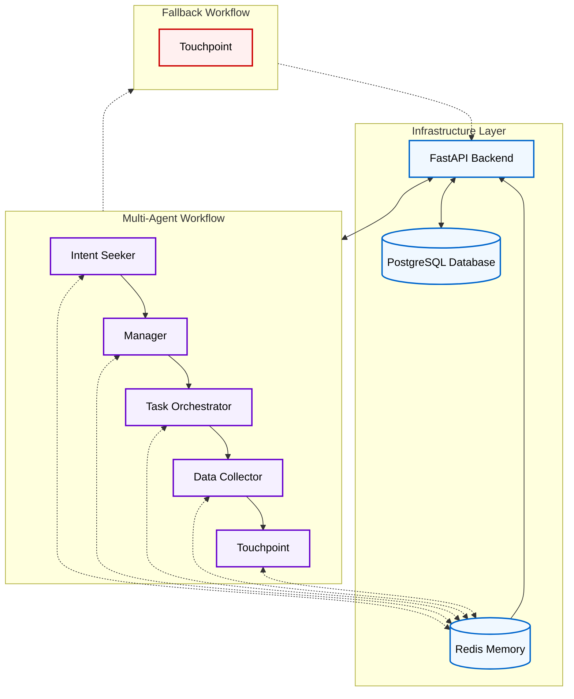
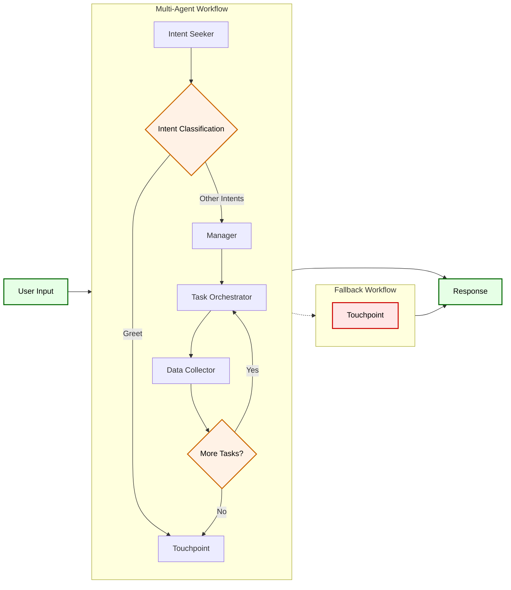

# Multi-Agent Conversational AI System

A sophisticated conversational AI system built with FastAPI, LangGraph, and multi-agent orchestration. This system provides intelligent conversation capabilities with persistent memory, task decomposition, and fallback mechanisms.

## 🏗️ Architecture Overview

### Core Components

- **FastAPI Backend** - Async web API with comprehensive endpoints
- **Multi-Agent Workflow** - LangGraph-based orchestration with 5 specialized agents
- **Dual Memory Persistence** - Redis and PostgreSQL for conversation state
- **Docker Orchestration** - Multi-service containerized deployment
- **Database Layer** - SQLAlchemy with async PostgreSQL

### Agent Workflow

The system uses a sophisticated multi-agent workflow:

1. **Intent Seeker** - Classifies user intentions (greet, ask, buy, sell, hold, review, report, recommend, other)
2. **Manager** - Breaks down inquiries into actionable tasks
3. **Task Orchestrator** - Coordinates task execution and data collection
4. **Data Collector** - Gathers and processes relevant information
5. **Touchpoint** - Generates final responses and maintains conversation flow

## 🚀 Features

### Core Capabilities
- **Conversational Memory** - Persistent thread-based conversations across sessions
- **Intention Classification** - Automatic detection of user intent and inquiry type
- **Task Decomposition** - Breaking complex requests into manageable tasks
- **Data Collection** - Intelligent gathering and processing of relevant information
- **Fallback Mechanisms** - Graceful error handling with dedicated fallback workflows
- **Performance Monitoring** - Real-time tracking of message processing times

### Infrastructure Features
- **Dual Persistence** - Redis and PostgreSQL checkpointers for conversation memory
- **Session Management** - Full CRUD operations with checkpoint history
- **Health Monitoring** - Comprehensive health checks for all services
- **Environment Management** - Pydantic settings with .env support
- **Migration System** - Alembic integration with automated scripts

### Development Features
- **Docker Orchestration** - Multi-service setup with health checks
- **Development Tools** - Comprehensive Makefile for build/run/migration operations
- **Workspace Automation** - Automated setup and synchronization scripts
- **Container Security** - Non-root users and proper security practices

## 📋 Prerequisites

- Python 3.12+
- Docker and Docker Compose
- pipenv (for dependency management)
- PostgreSQL (for data persistence)
- Redis (for caching and memory)

## 🛠️ Installation & Setup

### 1. Clone the Repository

```bash
git clone git@github.com:igorjpimenta/multiagent-workflow-template.git
cd multiagent-workflow-template
```

### 2. Environment Configuration

Create a `.env` file in the root directory:

```env
# API Configuration
PORT=4000
DEBUG=true

# Database Configuration
DB_HOST=postgres
DB_PORT=5432
DB_NAME=agent_db
DB_USER=agent_user
DB_PASSWORD=your_password
SSL_MODE=false

# Redis Configuration
REDIS_HOST=redis
REDIS_PORT=6379
REDIS_PASSWORD=your_redis_password
REDIS_SSL=false

# OpenAI Configuration
OPENAI_API_KEY=your_openai_api_key
```

### 3. Development Setup

#### Using Makefile (Recommended)

```bash
# Start all services
make run

# Start only API development server
make run-api

# Start only database services
make run-postgres
make run-redis
```

#### Manual Setup

```bash
# Setup workspace
./scripts/setup_workspace.sh

# Start development environment
./scripts/local_run.sh
```

### 4. Docker Deployment

```bash
# Build and start all services
make up

# View logs
make logs

# Stop services
make down
```

## 🗄️ Database Setup

### Initialize Database

```bash
# Initialize with all migrations
make migration-init

# Apply latest migrations
make migration-upgrade

# Check migration status
make migration-current
```

### Create New Migrations

```bash
make migration-create MESSAGE="your migration description"
```

## 🚀 Usage

### API Endpoints

#### Chat Endpoint
```bash
POST /chat/
{
  "message": "Hello, how can you help me?",
  "session_id": "optional-session-id"
}
```

#### Session Management
```bash
# Get all sessions
GET /sessions/

# Create new session
POST /sessions/

# Get session by ID
GET /sessions/{session_id}

# Get session messages
GET /sessions/{session_id}/messages

# Get session checkpoints
GET /sessions/{session_id}/checkpoints

# Delete session
DELETE /sessions/{session_id}
```

#### Health Check
```bash
GET /health/
```

### Example Usage

```python
import requests

# Start a conversation
response = requests.post("http://localhost:4000/chat/", json={
    "message": "I need help analyzing market data",
    "session_id": "user-123"
})

print(response.json())
# {
#   "response": "I'll help you analyze market data...",
#   "session_id": "user-123",
#   "memory_enabled": true,
#   "fallback_used": false,
#   "message_count": 2,
#   "performance": {
#     "total_time": "1.23s"
#   }
# }
```

## 🏗️ Development

### Project Structure

```
tryout_agents/
├── app/
│   ├── core/
│   │   ├── agent.py              # Main agent orchestration
│   │   ├── workflows.py          # Workflow definitions
│   │   ├── nodes/                # Agent node implementations
│   │   ├── memory/               # Memory management
│   │   ├── database/             # Database layer
│   │   ├── config/               # Configuration management
│   │   ├── models/               # Data models
│   │   ├── prompts/              # Agent prompts
│   │   └── states.py             # State management
│   ├── routes/                   # API endpoints
│   ├── models/                   # API schemas
│   ├── api.py                    # FastAPI application
│   └── main.py                   # Application entry point
├── docker/                       # Docker configurations
├── scripts/                      # Automation scripts
├── internal/                     # Database migrations
├── docker-compose.yml            # Service orchestration
├── Makefile                      # Development commands
└── Pipfile                       # Python dependencies
```

### Key Components

#### Agent System (`app/core/agent.py`)
- Main orchestration logic
- Memory-enabled conversation processing
- Fallback mechanisms
- Performance monitoring

#### Workflows (`app/core/workflows.py`)
- Default workflow with all 5 agents
- Fallback workflow for error handling
- Conditional edge routing

#### Memory Management (`app/core/memory/`)
- Redis and PostgreSQL checkpointers
- Thread-based conversation persistence
- State transformation and caching

#### Database Layer (`app/core/database/`)
- SQLAlchemy async models
- Session and message persistence
- Health monitoring

### Development Commands

```bash
# Build all Docker images
make build

# Start development environment
make run

# View service logs
make logs-api
make logs-redis
make logs-postgres

# Database operations
make migration-create MESSAGE="description"
make migration-upgrade
make migration-current

# Clean up
make clean
```

## 🔧 Configuration

### Environment Variables

| Variable | Description | Default |
|----------|-------------|---------|
| `PORT` | API port | 4000 |
| `DEBUG` | Debug mode | false |
| `DB_HOST` | Database host | postgres |
| `DB_PORT` | Database port | 5432 |
| `DB_NAME` | Database name | agent_db |
| `DB_USER` | Database user | agent_user |
| `DB_PASSWORD` | Database password | - |
| `REDIS_HOST` | Redis host | redis |
| `REDIS_PORT` | Redis port | 6379 |
| `REDIS_PASSWORD` | Redis password | - |
| `OPENAI_API_KEY` | OpenAI API key | - |

### Agent Configuration

The system supports multiple agent types with different capabilities:

- **Intent Seeker**: Classifies user intentions
- **Manager**: Task decomposition and planning
- **Task Orchestrator**: Workflow coordination
- **Data Collector**: Information gathering
- **Touchpoint**: Response generation

## 🧪 Testing

### Health Checks

```bash
# Check API health
curl http://localhost:4000/health/

# Check database health
make migration-check
```

### Performance Monitoring

The system includes built-in performance monitoring:

- Message processing time tracking
- Memory usage monitoring
- Fallback usage statistics
- Session persistence metrics

## 🚀 Deployment

### Production Deployment

1. **Environment Setup**
   ```bash
   # Set production environment variables
   export DEBUG=false
   export SSL_MODE=true
   ```

2. **Database Migration**
   ```bash
   make migration-upgrade
   ```

3. **Docker Deployment**
   ```bash
   make up
   ```

### Scaling Considerations

- **Horizontal Scaling**: API services can be scaled independently
- **Database Scaling**: PostgreSQL can be configured with read replicas
- **Redis Clustering**: Redis can be configured in cluster mode
- **Load Balancing**: Nginx configuration included for load balancing

## 🔒 Security

### Security Features

- **Non-root Containers**: All services run as non-root users
- **Environment Isolation**: Proper environment variable management
- **Database Security**: SSL/TLS support for database connections
- **API Security**: CORS configuration and input validation
- **Memory Security**: Secure checkpointing with encryption support

### Best Practices

- Use strong passwords for database and Redis
- Enable SSL in production
- Regularly update dependencies
- Monitor logs for security events
- Use environment-specific configurations

## 🤝 Contributing

### Development Workflow

1. **Setup Development Environment**
   ```bash
   make run
   ```

2. **Create Feature Branch**
   ```bash
   git checkout -b feature/your-feature
   ```

3. **Make Changes and Test**
   ```bash
   # Test your changes
   make logs-api
   ```

4. **Create Migration (if needed)**
   ```bash
   make migration-create MESSAGE="your changes"
   ```

5. **Submit Pull Request**

### Code Standards

- Follow PEP 8 for Python code
- Use type hints throughout
- Add comprehensive docstrings
- Include error handling
- Write tests for new features

## 📚 Documentation

### Additional Resources

- [FastAPI Documentation](https://fastapi.tiangolo.com/)
- [LangGraph Documentation](https://langchain-ai.github.io/langgraph/)
- [SQLAlchemy Documentation](https://docs.sqlalchemy.org/)
- [Docker Documentation](https://docs.docker.com/)

### Architecture Diagrams

The system follows a microservices architecture with:



#### Agent Workflow Flow



## 📄 License

This project is licensed under the MIT License - see the LICENSE file for details.

## 🆘 Support

For support and questions:

- Create an issue in the repository
- Check the documentation
- Review the logs: `make logs`

---

**Built with ❤️ using FastAPI, LangGraph, and modern AI practices.**